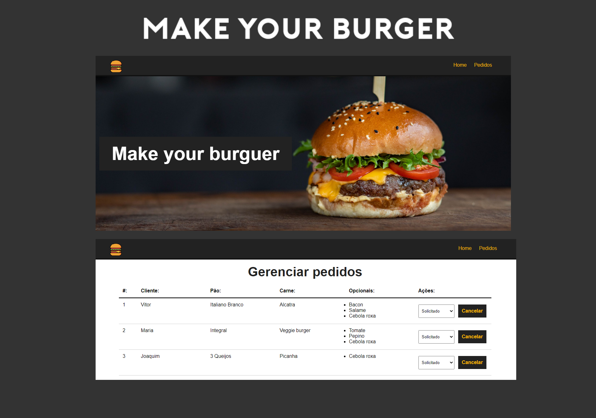

# Make your burger
<p align="center" >
  
</p>


## 💻 The project
<p>
  Make your burger is a component-based application, we have the frontend where the customer fills out the hamburger form, this request goes to the database and returns to the dashboard through an API with all requests.
</p>
<p>
  The orders dashboard also has a kind of CRUD, where we can delete and change orders.
</p>

## 🚀 Technologies
* VueJs
* Vue Router
* JSON server API
* HTMl | CSS | JAVASCRIPT

## :wrench: Project setup
```
npm install
```
```
npm run backend
```
* Em outro terminal
```
npm run serve
```
